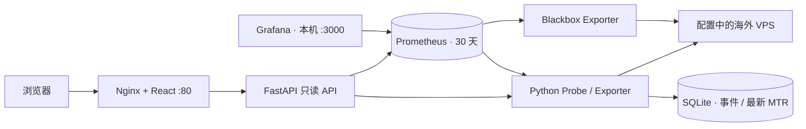

# Network Observatory

中国大陆 Ubuntu 24.04 观测点到海外 VPS 的低流量网络质量监控。React / Vite / Tailwind 深色界面为日常入口，ECharts 展示历史曲线，Grafana 保留高级排查能力。运行时不使用 SaaS、Google API、CDN 字体或远程前端资源。

**完整六服务应用，默认不预置公共目标或假数据。** 第一次启动会显示空状态，填入自己的 VPS 后立即开始真实探测。本项目不需要在海外 VPS 安装 agent，也不自动部署 iperf3。

## 1. 架构与数据流



- Python 是主观测源；按配置异步运行探测，抓取 `/metrics` 不触发探测。
- ICMP 每 10 秒一轮 5 包，0.2 秒包间隔；TCP / HTTP(S) 每 30 秒；DNS 每 60 秒；MTR 每 300 秒，10 轮、最多 30 hop、45 秒强制超时。
- 常规探测并发 8，MTR 并发 1；单节点同一任务不重叠，启动随机分散。节点最多 100、端口最多 8；大量节点必须降低频率，观察探测时间戳避免积压。
- Blackbox 每 60 秒独立交叉验证 ICMP / TCP / HTTP HEAD；主状态使用 Python 结果，避免重复来源相互覆盖。可在 nodes.yaml 关闭 Blackbox 主动探测。
- SQLite 保存事件、防抖状态、每节点最新 MTR。Prometheus 保存时间序列。路由 hop IP 不写入 Prometheus 标签。
- 网络 `monitoring_internal` 是普通 bridge，允许出站。**不能改为 `internal: true`**，否则主动探测无法出网。只有 Web 与 Grafana 映射宿主端口。
- `node/region/host` 是公共指标标签；仅 TCP 增加有限 `port`，探测成功/时间戳增加有限 `kind`。不要频繁修改节点名称，它是历史与事件标识。

详细决策见 [docs/architecture.md](docs/architecture.md)，验证记录见 [docs/validation.md](docs/validation.md)。

## 2. 推荐服务器资源

小规模节点建议 **2 vCPU / 2 GB RAM / 15–20 GB 空闲磁盘**。六容器资源上限合计约 1.6 GB；空载实际消耗通常更低，以 `docker stats` 实测。1 GB 机器建议关闭 Grafana 常驻运行并降低节点数，不保证完整六服务稳定运行。

Prometheus 默认同时受 **30d 与 4GB** 限制，先触发者决定保留历史长度。4GB 不包含 WAL / 临时文件，留足磁盘余量。节点、TCP 端口、Blackbox 序列数会增加存储，不能保证任意规模均保留完整 30 天。

默认 Ping IPv4 每天每节点约 7 MB 三层往返流量（5 包/10s，不含链路开销）。TLS 握手/证书、TCP 与 MTR 额外流量随端口数、证书大小、hop 数增加，通常应按每节点每天几十 MB 的量级预算，而非承诺固定流量。HEAD 不传页面正文；没有 iperf3 / speedtest。降低频率、关闭不必要的 Blackbox/MTR 可进一步降低流量。浏览器打开时另有看板查询流量。

## 3. Ubuntu 24.04 安装 Docker

推荐使用 Docker 官方 apt 仓库；脚本按官方安装方法执行，不替换已有冲突软件、不修改防火墙：

```bash
sudo bash scripts/install.sh
sudo docker version
sudo docker compose version
```

若尚未下载项目，可先参照 [Docker Ubuntu 官方安装说明](https://docs.docker.com/engine/install/ubuntu/)。已有 docker.io、旧 Compose、Podman 或生产容器时，先按官方迁移说明确认安装来源，脚本会明确停止而不自动删除。

后续命令假设当前账户有 Docker 权限。可使用 `sudo docker compose ...`；可选加入 docker 组：

```bash
sudo usermod -aG docker "$USER"
# 退出 SSH 后重新登录，再运行 docker info
```

docker 组权限接近 root，只给予可信管理员。安装脚本会执行 `systemctl enable --now docker`，配合 `restart: unless-stopped` 可在服务器重启后恢复监控；被手动停止的容器保持停止。

## 4. 获取项目与初始化

从 [GitHub public 仓库](https://github.com/zz123-jj/network-monitor) 获取源码：

```bash
git clone https://github.com/zz123-jj/network-monitor.git
cd network-monitor
cp .env.example .env
bash scripts/init-env.sh
vim .env
vim config/nodes.yaml
```

也可以使用完整源码压缩包，上传并解压：

```bash
# 在本地上传实际交付的文件
scp network-monitor.tar.gz USER@SERVER_IP:/tmp/
# 在 Ubuntu 上
mkdir -p ~/apps
cd ~/apps
tar -xzf /tmp/network-monitor.tar.gz
cd network-monitor
cp .env.example .env
bash scripts/init-env.sh
vim .env
vim config/nodes.yaml
```

完成配置后执行 `docker compose up -d --build --wait --wait-timeout 180`。Docker 安装和访问方式见前后章节。

`init-env.sh` 只在密码为空时生成随机 Grafana 密码，保存在 `.env`，不会打印密码。自行配置时填入足够长随机密码，避免 `$`、`#` 等 Compose dotenv 特殊字符，或使用 dotenv 单引号规则。

`.env` 至少确认：

```dotenv
WEB_BIND=0.0.0.0
WEB_PORT=80
GRAFANA_BIND=127.0.0.1
GRAFANA_PORT=3000
GRAFANA_ADMIN_USER=admin
GRAFANA_ADMIN_PASSWORD=你的随机密码
PROMETHEUS_RETENTION=30d
PROMETHEUS_RETENTION_SIZE=4GB
```

密码为空时 Compose 明确拒绝启动。不要提交 `.env` 到 Git。修改 Grafana 环境中的初始密码不会更改已有数据卷中的账户密码；使用 Grafana 账户设置修改，或：

```bash
docker compose exec grafana grafana cli admin reset-admin-password '新的随机密码'
```

## 5. 添加第一个 Tokyo VPS

`config/nodes.yaml` 使用完整配置示例。把末尾 `nodes: []` 替换为真实节点：

```yaml
nodes:
  - name: Tokyo
    host: 你的Tokyo公网IP
    region: Japan
    location: Tokyo
    enabled: true
    tcp_ports: [22, 443]
    https_url: https://你的域名/health
    tags: [vless, hysteria2]
    provider: 你的服务商
    description: 东京主节点
```

- 没有 HTTPS 服务时 **删除 `https_url`**；不要填写不存在的 URL，否则会 Warning。
- `tcp_ports` 只填写真正开放的 TCP 端口。Hysteria2 通常基于 UDP，本版 TCP 连接测试不能代表 UDP 代理可用性。空列表表示不进行 TCP 测试。
- `host` 支持 IPv4 / IPv6 / ASCII 域名，不接受选项、URL、空白或 shell 字符。域名默认 IPv4；字面 IPv6 使用 IPv6，观测服务器必须具备对应出站网络。
- URL 支持 HTTP / HTTPS，证书校验开启，无凭据、fragment，不自动跟随重定向。URL 应指向该 VPS 的直连域名；若域名使用 CDN，结果反映观测点到 CDN 的路径，不一定是到 VPS 的路径。
- HTTP 使用 HEAD，不下载网页内容。服务若拒绝 HEAD（例如 405），换为支持 HEAD 的轻量健康端点。
- `enabled: false` 会停止探测，Nodes 页面显示 Disabled；原有历史仍在 Prometheus 留存窗口内。
- 保存文件 **10 秒内自动重载**，不需要重建镜像或重启。采用挂载整个 config 目录，支持编辑器原子替换文件。格式错误保留最后有效配置，在 UI、日志与 `network_config_ok` 明确显示。

添加更多节点：追加一个列表项。删除节点：删掉列表项或设 disabled。修改 IP / 端口 / URL：编辑对应字段。节点改 IP 后 UI 当前节点只显示新 IP 曲线，旧 IP 历史仍可在 Grafana / PromQL 查询；改名视为新节点。

## 6. 一键启动与访问

```bash
docker compose config --quiet
docker compose up -d --build --wait --wait-timeout 180
docker compose ps
```

首次需要构建 Python / frontend 镜像，之后通常 `docker compose up -d` 即可。Web 默认 `http://SERVER_IP`，浏览器只访问同源 `/api`，无需配置前端 API 域名。

Grafana 默认 **仅本机** `http://127.0.0.1:3000`，通过 SSH 隧道访问：

```bash
ssh -N -L 3000:127.0.0.1:3000 USER@SERVER_IP
# 本地浏览器打开 http://localhost:3000
```

若希望 `http://SERVER_IP:3000`，在 `.env` 设置 `GRAFANA_BIND=0.0.0.0`，并在云安全组仅允许管理员 IP，再 `docker compose up -d grafana`。禁止匿名访问与开放注册；用户名、初始密码来自 `.env`。

如果只开放 Web 端口，可选择将 Grafana 经 Nginx 暴露在 `/grafana/`，保留 Grafana 登录认证。在 `.env` 增加以下两项（把地址改成实际公网地址；HTTPS 代理环境使用实际 HTTPS 地址）：

```ini
GRAFANA_ROOT_URL=http://SERVER_IP/grafana/
COMPOSE_FILE=docker-compose.yml:deploy/grafana-web.yml
```

随后运行 `docker compose up -d --wait --wait-timeout 180`，访问 `http://SERVER_IP/grafana/`。此入口为可选项，默认未开放。已有本机 `docker-compose.override.yml` 时，在 COMPOSE_FILE 中同时列出它，保留本机配置。Nginx 处理前缀与 WebSocket，Grafana 的内网 `/api/health` 地址不变。改域名/HTTPS 时更新 GRAFANA_ROOT_URL；升级 Nginx 时保留此挂载配置。

默认 **不发布** 9090 / 9115 / 8000 / 8080。不要为方便诊断将这些端口开放公网。

前端仅提供 HTTP。公网长期使用建议先在云安全组限制管理员来源；如需要域名/HTTPS/登录认证，放在你已有的 TLS 认证反向代理后，设 `WEB_BIND=127.0.0.1`、`WEB_PORT=8088`。本版没有内置 Web 用户系统或自动申请 TLS 证书。

## 7. 页面与状态含义

- **Overview**：节点总数、Online / Warning / Offline、平均 RTT / Loss、可点击节点卡、最近事件。Pending / Unknown 单独显示在节点上，计入 Total，不能被误当 Online。
- **Nodes**：搜索节点/IP/tag/provider，筛选 Status/Region，RTT/Loss 高值优先排序；移动端列表可横向滚动。
- **Node detail**：当前指标、全部 TCP 端口、HTTP 状态/TTFB、八种曲线、5m/1h/6h/24h/7d/30d、前一时间窗口、Live。Ctrl+滚轮缩放、拖动图表与底部滑块平移。
- **Routes**：最新 MTR 的数字 IP、平均/最低/最高 RTT（最低/最高保存在 route JSON）、loss、StDev；未知 hop 为空，不显示假的 0ms。第一版不保存历史拓扑、不进行反向 DNS，hostname 因此通常为空。
- **Events**：Offline / Recovery / High latency / Packet loss / High jitter，节点/类型过滤、按 ID 翻页。
- **Settings**：只读探测频率、阈值、配置说明。

状态规则：

| 状态 | 规则 |
|---|---|
| Pending | 所需 Ping/TCP/HTTP 探测尚未全部完成 |
| Unknown | 所需结果超过各自周期的 3 倍未更新，或本地工具发生错误 |
| Offline | 所有已配置的网络可达性检查均失败且结果新鲜 |
| Warning | 部分检查/端口失败，或 RTT / loss / jitter 达 warning 阈值 |
| Online | 配置的检查正常且无指标阈值异常 |

ICMP 被禁而 TCP 或 HTTP 正常为 Warning。配置多个 TCP 端口时任意成功说明节点可达，但任一失败仍显示 Warning。HTTPS 非 2xx/3xx、DNS/TLS/连接失败为请求失败；已有 HTTP 响应或 TCP 建连证据时仍判网络可达，显示 Warning 而非 Offline。MTR 与独立 DNS 的失败显示具体探测数据，但不决定最终在线状态，避免因路由器隐藏 hop 误报。

`RTT` 当前卡片显示本轮平均值；指标另保留最后回包 RTT、min、max。Jitter 是同一轮成功回包 RTT 的相邻绝对差平均值；少于两个回包时为空。MTR jitter 是 StDev，与 Ping jitter 定义不同。

curl DNS/Connect/TLS 显示各阶段耗时，TTFB 是从请求开始累计到首字节，Total 是 HEAD 请求总时长；未建立 TLS 时 TLS 为空。阶段耗时从 curl 累计计时差值计算，禁止把累计 connect 当作 TCP 阶段时长。

所有存储时间为 UTC Unix epoch，Web/Grafana 显示 **Asia/Shanghai / UTC+8**，容器日志使用 UTC。Probe 失败延迟为 NaN，API 为 null，曲线断开；Offline 区域浅红标记。前端与 API 的失败有明确横幅，不伪造健康数据。

## 8. 修改频率、阈值与保留时间

```yaml
settings:
  intervals:
    ping: 10
    tcp: 30
    https: 30
    dns: 60
    mtr: 300
  ping_count: 5
  concurrency: 8
  mtr_enabled: true
  blackbox_enabled: true
  event_retention_days: 30
  event_max_rows: 50000
  thresholds:
    warning_rtt_ms: 120
    critical_rtt_ms: 200
    warning_loss_percent: 2
    critical_loss_percent: 10
    warning_jitter_ms: 30
    critical_jitter_ms: 60
    debounce_samples: 3
    cooldown_seconds: 300
```

Ping 最低 5s、TCP/HTTP 最低 10s、DNS 最低 30s、MTR 最低 300s，防止误配置高流量。警告状态实时显示；事件默认连续 3 个有效 Ping 观察周期确认，约 30 秒。相同异常不每轮新增；恢复同样防抖且始终记录，再次异常在冷却窗内抑制，已有异常状态跨重启保留。Critical 使用相同异常类型、不同 severity，节点状态仍是 Warning；严重阈值不扩展第四种远端状态。

MTR 单并发，节点多时一轮会超过 5 分钟；例如 100 节点不能期待各自都严格按 5 分钟完成。结合 Routes 的时间戳、`network_probe_timestamp_seconds{kind="mtr"}` 判断数据新鲜程度，降低节点数或增大周期。

修改 `.env` 的 `PROMETHEUS_RETENTION` / `PROMETHEUS_RETENTION_SIZE` 后：

```bash
docker compose up -d prometheus
```

修改 Blackbox 周期（默认 60s）需编辑 `config/prometheus.yml` 对应 job 的 `scrape_interval`，然后 `docker compose restart prometheus`。主 Probe 的频率仅修改 nodes.yaml。

## 9. 验证真实监控

先查看运行状态与自检：

```bash
docker compose ps
curl -fsS http://localhost/api/health
bash scripts/test.sh
```

`/api/health` 的 `ok/prometheus/scraping` 应全部 true（首次 scrape 尚未完成时 scraping 可能短暂 false）。内部诊断在容器内执行，下面这些 localhost 指的是对应容器，不是 Ubuntu 宿主：

```bash
docker compose exec prometheus wget -qO- http://localhost:9090/-/healthy
docker compose exec probe python -c 'import urllib.request; print(urllib.request.urlopen("http://localhost:8000/metrics").read().decode())'
docker compose exec blackbox wget -qO- http://localhost:9115/metrics
docker compose exec frontend wget -qO- http://127.0.0.1:8080/api/health
docker compose exec grafana wget -qO- http://localhost:3000/api/health
```

确认 Ping 与 MTR 是实际命令执行结果，替换为你的配置 IP：

```bash
docker compose exec probe ping -n -c 5 你的Tokyo公网IP
docker compose exec probe mtr -j -n -c 10 你的Tokyo公网IP
# 单独验证 TLS 与 HEAD 响应
docker compose exec probe curl -I --connect-timeout 5 --max-time 10 https://你的域名/health
```

在宿主 Ubuntu 想独立比对可 `sudo apt install iputils-ping mtr-tiny curl`，然后运行相同命令。不要把一次失败等同于整体 Offline，检查 VPS 入站 ICMP/TCP、国内云出站策略与目标应用。

确认 Prometheus 真抓到了指标：

```bash
docker compose exec backend python -c 'import json,urllib.request; q="http://prometheus:9090/api/v1/query?query=network_ping_avg_ms"; print(json.dumps(json.load(urllib.request.urlopen(q)),indent=2))'
docker compose exec backend python -c 'import json,urllib.request; q="http://prometheus:9090/api/v1/targets"; print(json.dumps(json.load(urllib.request.urlopen(q)),indent=2))'
```

检查 job `network-probe` 为 up，节点的 ping 时间戳不断变化，端口每 30s 更新，MTR 默认 5 分钟更新。Web Overview 出现配置的 Tokyo；节点页 5m 图出现曲线；Routes 出现真实跳点。在 Grafana 的 Network Observability / Network Monitor 仪表盘选择 Tokyo，曲线应与 Web 一致。Grafana Explore 可以执行 `network_ping_avg_ms{node="Tokyo"}`。

测试失败/恢复时，可在你管理的 VPS 短暂关闭一个已配置 TCP 测试端口：卡片应 Warning，逐端口显示失败、TCP 曲线断点。Offline 需要所有可达性检查失败；确认不要误封正在使用的 SSH 端口。事件只对五类指标异常生成，部分 TCP 失败会显示状态但本版没有单独 TCP 事件。

开发测试（Python 3.12+ / Node 22.12+）：

```bash
python3 -m venv .venv
.venv/bin/pip install -r requirements-dev.txt
PYTHONPATH=. .venv/bin/pytest -q tests
.venv/bin/python scripts/validate.py
cd frontend
npm ci
npm run build
npm audit
```

## 10. Grafana 与 Prometheus 使用

Grafana 自动 provisioning Prometheus 数据源 UID `prometheus`，以及 Network Monitor 仪表盘；无需手动配置。包含 Overview、RTT、Loss、Jitter、TCP、HTTPS Total/TTFB、DNS、TLS、MTR、Node status、Blackbox success；支持 Region/Node 变量，标准时间选择器可选择六种范围。

仪表盘源文件 `grafana/dashboards/network-monitor.json` 为权威版本，UI 修改不持久保存；高级临时分析使用 Explore 或另存为自建仪表盘。Provisioning 与 Grafana 数据各自持久化，不覆盖用户另建仪表盘。

Prometheus 如需临时管理 UI，可仅绑定本机发布端口：

```yaml
# 创建 docker-compose.admin.yml
services:
  prometheus:
    ports: ['127.0.0.1:9090:9090']
```

```bash
docker compose -f docker-compose.yml -f docker-compose.admin.yml up -d prometheus
ssh -N -L 9090:127.0.0.1:9090 USER@SERVER_IP
# 本地浏览器 http://localhost:9090
# 完成后回到默认配置关闭端口
docker compose up -d prometheus
```

常用 PromQL：

```promql
network_node_up
network_node_status
network_ping_avg_ms{node="Tokyo"}
network_packet_loss_percent{node="Tokyo"}
network_jitter_ms{node="Tokyo"}
network_tcp_connect_ms{node="Tokyo",port="443"}
network_https_total_ms{node="Tokyo"}
network_mtr_avg_ms{node="Tokyo"}
network_probe_timestamp_seconds{node="Tokyo",kind="ping"}
up{job="network-probe"}
network_config_ok
```

历史 API 每曲线返回最多约 601 个时间点，并限制查询范围、并发与缓存大小；浏览器不提交 PromQL。长时间范围按步长采样，可能错过很短的尖峰，用 Grafana 放大对应窗口核实。当前配置的 freshness 周期也用于历史筛选；改周期后部分旧稀疏数据可能成为缺口。

## 11. 日常运维

```bash
# 状态 / 消耗
docker compose ps
docker stats --no-stream
docker system df
# 日志（已设置 10MB × 3 轮转）
docker compose logs --tail=100
docker compose logs -f probe
docker compose logs -f backend
# 重启全部 / 单个
docker compose restart
docker compose restart probe
# 暂停运行 / 恢复
docker compose stop
docker compose start
# 删除容器与网络但保留所有数据卷
docker compose down
# 再次启动
docker compose up -d --wait
```

**正常操作不要使用 `docker compose down -v`，它会删除历史数据、Grafana 与事件数据库。** 不要执行 `docker volume prune` 清除仍需使用的监控数据卷。

更新先备份，再拉取/解压新版源代码，保留 `.env` 与 `config/nodes.yaml`：

```bash
bash scripts/backup.sh
# Git 管理时：git pull --ff-only
# 解压更新时不要覆盖自己的配置与 .env
docker compose pull prometheus blackbox grafana
docker compose build --pull
docker compose up -d --wait --wait-timeout 180
bash scripts/test.sh
```

镜像版本固定在 `.env.example` / Compose，前端有 package-lock；Python 应用依赖使用锁定文件。更换版本先在备用环境验证，不自动跟随 latest。`restart` 不应用 .env / image 变化，使用 `up -d` 重新创建。

## 12. 数据备份与恢复

持久化卷：

| Volume | 数据 |
|---|---|
| prometheus_data | TSDB / WAL |
| grafana_data | 用户、设置、自建 Dashboard |
| probe_data | SQLite events / alert 状态 / 最新 routes |
| discovery | 自动生成的 Blackbox target 文件，可重建 |

备份脚本会短暂停止 probe/prometheus/grafana，生成一致性冷备份并自动重新启动；Web/API 在此期间可能显示服务不可用。备份含 `.env` 密码，权限 600，请安全异地保存。

```bash
bash scripts/backup.sh
ls -lh backups/
```

备份在 `backups/network-monitor-UTC时间.tar.gz`。配置与 Grafana provisioning 也随备份保存。SQLite 事件按天数和总条数双限制删除，不无限保存。

恢复推荐进入新的项目目录，并给 `.env` **新的 `COMPOSE_PROJECT_NAME`**，使用全新空数据卷：

```bash
# 将可信备份展开到临时目录，先审核/还原 config/、grafana/、.env
mkdir -p /tmp/network-monitor-restore
tar -xzf /path/to/backup.tar.gz -C /tmp/network-monitor-restore
# 复制备份 config/ 与 grafana/ 到项目目录；按需复制 .env 并修改项目名/端口
# 如原实例仍运行，为新实例使用不同 WEB_PORT / GRAFANA_PORT
# 新项目目录先构建镜像（docker compose build），不要先 up
docker compose build
bash scripts/restore.sh /path/to/backup.tar.gz
docker compose up -d --wait --wait-timeout 180
bash scripts/test.sh
```

`restore.sh` 拒绝向非空卷恢复，不自动清空已有数据，不自动覆盖管理员配置。第一次运行会 create 未启动容器以确定卷名；备份 tar 使用数值 UID 保留 Prometheus/Grafana 文件所有权。只使用你信任的备份文件。不要一边运行 Prometheus 一边直接复制 WAL 数据目录，也不要只复制 SQLite 主文件而漏掉 WAL。

## 13. 防火墙与访问安全

云安全组建议：22 仅管理员 IP，80/443 仅需要访问看板的人，3000 默认不开放，9090/9115/8000/8080 不开放。VPS 端需按监控需求放行国内观测点来源的 ICMP 和配置 TCP 端口。

Docker 发布端口可能绕过常规 UFW INPUT 规则，**不能只依赖 `ufw deny`**。优先使用云安全组限制来源，必要时配置 DOCKER-USER / nftables 的 Docker 对应转发链；避免未经验证批量修改规则导致 SSH 断连。参照 [Docker 防火墙说明](https://docs.docker.com/engine/network/packet-filtering-firewalls/)。

Probe 与 Blackbox 仅 NET_RAW、无 privileged / NET_ADMIN / Docker socket；其他服务无额外 capabilities。配置只读，API 不允许写配置、执行 shell、任意目标扫描或任意 PromQL。控制平面节点数据可能涉及基础设施隐私，公网共享前限制访问。

## 14. 中国大陆镜像/依赖下载失败

先区分镜像 registry、Docker Hub auth、Debian apt、PyPI、npm 网络问题：

```bash
docker compose pull prometheus blackbox grafana
docker pull python:3.12.15-slim-bookworm
docker pull node:22.23.3-alpine
docker pull nginx:1.28.3-alpine
docker compose build --progress plain
```

- 网络抖动：先重试 `docker pull`，成功后重跑构建；缓存保留已下载层。
- 使用云厂商官方提供给你账号的可信 registry 加速服务，按其文档配置 daemon registry-mirrors。不要使用不明公共代理，不关闭 TLS 校验，不盲目信任同名镜像。
- 阿里云加速器只支持有限镜像范围，对某个 tag 返回 not found 不能证明官方版本不存在，参见[官方限制说明](https://www.alibabacloud.com/help/en/acr/product-overview/product-change-acr-mirror-accelerator-function-adjustment-announcement)。项目默认 Prometheus/Blackbox 使用官方 Quay；Grafana 与三个基础镜像仍为官方 Docker Hub，可从可信联网机器下载后经 SSH 导入，或同步到自己的 ACR。
- `.env` 的 `PROMETHEUS_IMAGE/BLACKBOX_IMAGE/GRAFANA_IMAGE/PYTHON_IMAGE/NODE_IMAGE/NGINX_IMAGE` 支持改为你自己的可信镜像仓库地址；保留版本/核对 digest。当前官方发行信息见 [Prometheus 下载](https://prometheus.io/download/) 和 [Grafana Releases](https://github.com/grafana/grafana/releases)。
- 构建依赖源可设置 `APT_MIRROR`（替换 Debian 主仓库 URL，安全仓库另按组织政策处理）、`PIP_INDEX_URL`、`NPM_REGISTRY`。它们是构建参数，不影响运行；不得包含凭据。填写你信任且提供对应内容的源，不设全局 pip/npm 配置。
- `docker buildx build` 使用的 builder 网络可能和宿主不同，Docker CLI 能下载不代表 builder 能访问 auth/docker.io。先预拉官方 base image，然后重试。

完全离线迁移可在**相同 CPU 架构**且网络畅通的 Docker 机器上构建全部镜像，复制相同项目与 `.env` 的镜像名称设置，再导入。新增脚本会保存六个镜像、架构/项目名、SHA-256 和源码：

```bash
# 联网机器，确保 COMPOSE_PROJECT_NAME 与目标机器相同
COMPOSE_PARALLEL_LIMIT=1 docker compose build --pull=false
docker compose pull prometheus blackbox grafana
bash scripts/export-offline.sh ../network-monitor-offline
# 将整个离线目录和项目源码传至目标 Ubuntu，在项目目录中执行：
bash scripts/deploy-offline.sh ../network-monitor-offline
```

源码归档不包含 .env、Git 历史、依赖缓存或业务数据卷；自己的 .env 另行安全传送，或生成新的密码。源码归档仍包含本机节点/额外 Compose 配置，按私有备份保管。恢复脚本先检查架构、COMPOSE_PROJECT_NAME 和 SHA-256，再执行 `--no-build --pull never`，不会删除卷或扫描清理其他镜像。迁移时保留原镜像名称和项目名；业务数据恢复仍使用第 12 节的备份脚本。

镜像已存在时，日常启动直接运行 `docker compose up -d --no-build --pull never --wait --wait-timeout 180`。离线模式不执行 pull；更新镜像后重新导出离线包。Docker 服务启用开机启动且容器已由 up 启动时，VPS 重启自动恢复；主动 stop/down 后不会自行创建或重新启动该栈，需要再次执行 up。

不要把 ARM64 构建产物直接当作 AMD64 镜像使用。联网构建时若目标为 AMD64，可使用支持多平台的 builder 显式构建 linux/amd64；之后需确认 Compose 使用相同应用 image tag。

## 15. 常见问题

| 现象 | 排查 |
|---|---|
| Compose 密码报错 | `.env` 中 Grafana 密码为空；运行 init-env.sh |
| probe 不启动 | logs probe 检查 nodes.yaml 格式/重复名字/字段/端口，首次无有效配置会拒绝启动 |
| config_ok=0 | 新配置无效，当前保留最后有效版本；修正后自动恢复 |
| Ping permission denied | 检查 NET_RAW、云环境是否禁 raw socket，不能删掉 cap_add |
| 100% loss 但 SSH 可达 | VPS 禁 ICMP；配置真实 TCP 端口，应该 Warning 而不是 Offline |
| MTR 中间跳 100% | 路由器限速/屏蔽 ICMP，查看终点实际损耗；不是路径必然丢包 |
| MTR 显示旧数据 | 单并发排队、目标无响应或命令超时；检查 timestamp、logs、节点数量 |
| HTTPS 405 | 端点不支持 HEAD，改为支持 HEAD 的健康路径 |
| HTTPS 错误 / code=0 | DNS、TCP、证书链、SNI、系统时间；curl 不跳过证书校验 |
| TCP 443 成功但 HTTPS 失败 | 可建立 socket 不代表正确 TLS/HTTP 服务，核实域名与证书 |
| 页面打开 API 502/503 | backend/probe/prometheus health、logs，浏览器请求应该同源 /api |
| 9090 在宿主不可访问 | 正常设计，内部命令检查，或临时 admin override + SSH 隧道 |
| Grafana 无曲线 | 等第一次 scrape，确认数据源 URL prometheus:9090 与节点启用，Explore 查询 up |
| Dashboard UI 修改消失 | 文件 provisioning 是权威源，修改 JSON 或另存自建仪表盘 |
| 改密码没生效 | 初始化环境密码只在第一次创建账户使用，使用账户设置/CLI |
| 时间错位 | Web/Grafana 固定 UTC+8，日志 UTC；同步宿主 NTP，Unix 时间不要手工加 8 小时 |
| 磁盘增长 | retention time/size、docker system df、日志轮转、旧镜像、SQLite 事件上限；不删除在用卷 |
| Out of memory | 看 docker stats / 宿主日志，降低节点/并发、增大周期或升级内存 |
| 宿主重启未恢复 | systemctl status docker；被 compose stop 的容器不会自动启动，执行 compose up -d |
| `.env` 改完没生效 | 使用 up -d 重新创建，restart 不会更新容器环境 |

## 16. 当前范围与限制

1. 单一国内观测点、单实例 SQLite，不提供高可用、多观测点聚合、远端 agent 或告警推送。海外实际质量需要在你的 Ubuntu 服务器与目标 VPS 之间验证。
2. MTR 只保存最新路由，无历史路径变化事件；数字 IP 模式不反向解析 hostname。高节点数需降低频率，最新路由 timestamp 可能明显晚于周期。
3. Ping 每轮默认 5 包，loss 分辨率为 20%，2% 阈值意味着任意一轮丢包进入 Warning，连续 3 次后才记事件。若需要细粒度损耗趋势，用 Grafana 聚合较长窗口或增大 ping_count（最多 10），不要把小样本瞬时 loss 当长期丢包率。
4. DNS 指标使用系统 getent resolver，包括本地缓存和 IP literal 的本地解析；它不是指定权威 DNS 的独立测试。域名默认 IPv4；不做 Happy Eyeballs 双栈对比。MTR 使用 ICMP，不代表 UDP/代理协议实际性能。
5. HEAD 不测试内容正确性、认证业务路径、代理协议、UDP 或带宽，重定向不跟随。iperf3 为明确延后功能，本版不暴露执行接口，未来实现必须限制并发/持续时间/流量，最短一小时周期且默认关闭。
6. Web 没有内置登录与 HTTPS，需要云安全组或已有认证 TLS 代理。Grafana 默认本机管理员入口。
7. 长范围曲线按步长采样，短异常可能被跳过；异常 Events 独立存储可查，Grafana 可放大排查。NaN / missing 不会转成 0。
8. 已在 Linux Docker 环境及一台实际 Ubuntu 24.04 大陆 VPS 上验证部署、真实节点、离线恢复和网页；未进行 30 天耐久或大量节点压力测试。环境、检查项与结果见 docs/validation.md。

代码采用 [MIT License](LICENSE)。Grafana/Prometheus 等第三方组件保留各自开源许可。
