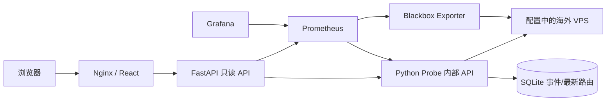

# Phase 1 · 架构决策

- 主探测：ICMP 10s（每轮 5 包、0.2s 间隔），TCP/HEAD 30s，DNS 60s，MTR 300s（10 轮、最多 30 hop）。独立 Blackbox 60s 交叉验证，不参与主状态判定。
- 不在 scrape 回调中执行探测。每个节点/探测独立任务，常规并发限制 8，MTR 并发限制 1；同一任务不会重叠。启动和周期分散，超时杀死并回收子进程。
- 指标公共标签仅 node/region/host；TCP 增加有限 port，探测健康增加有限 kind。无错误字符串、时间戳、hop IP 标签。最新 route JSON 存 SQLite，不产生路由 label 膨胀。
- 延迟失败为 NaN，HTTP/TCP/ICMP 成功值独立，probe timestamp 供历史过滤。状态 Pending/Unknown/Online/Warning/Offline；ICMP 禁用而应用端口可达为 Warning。无完整新鲜证据不宣告 Offline。
- nodes.yaml 每 10s 自动重载，验证失败保留最后有效配置并暴露 config_ok=0。目标文件原子写入共享 discovery volume，Prometheus file_sd 自动更新。
- SQLite 单写入服务、WAL、30 天事件保留与总条数上限；事件状态持久化，连续观察 debounce + cooldown，重启不重复生成已有异常。最新路线每节点一条。
- 六服务同一 monitoring_internal bridge。名称表示内部服务用途，并非 internal:true；probe/blackbox 必须能出站。仅 frontend 映射 80，Grafana 默认绑定 127.0.0.1:3000。
- Prometheus/Grafana/Probe 数据为独立命名 volume，config 与 provisioning 挂载只读。容器 restart unless-stopped、日志轮转、资源上限、最小 NET_RAW 权限，无 Docker socket。
- API 没有 shell、目标提交、任意 PromQL 或配置写入；历史范围最多 30 天，约 600 点/曲线，服务端固定指标白名单。公网看板包含基础设施信息，建议安全组限制管理员 IP 或置于认证 TLS 反向代理之后。
